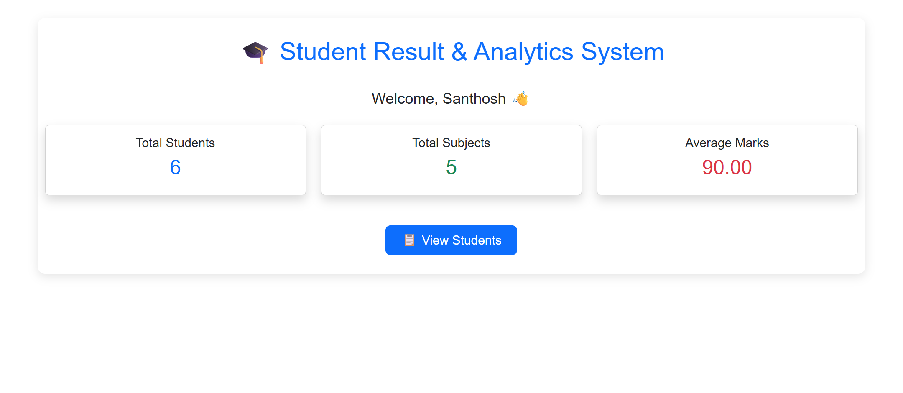
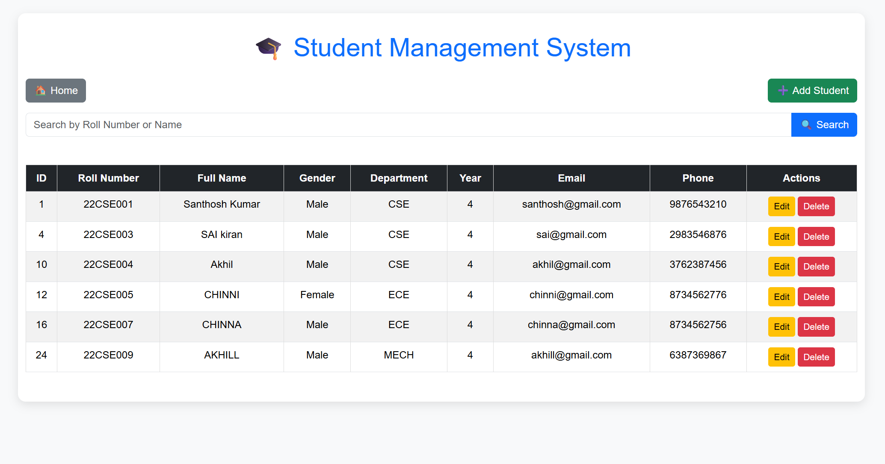
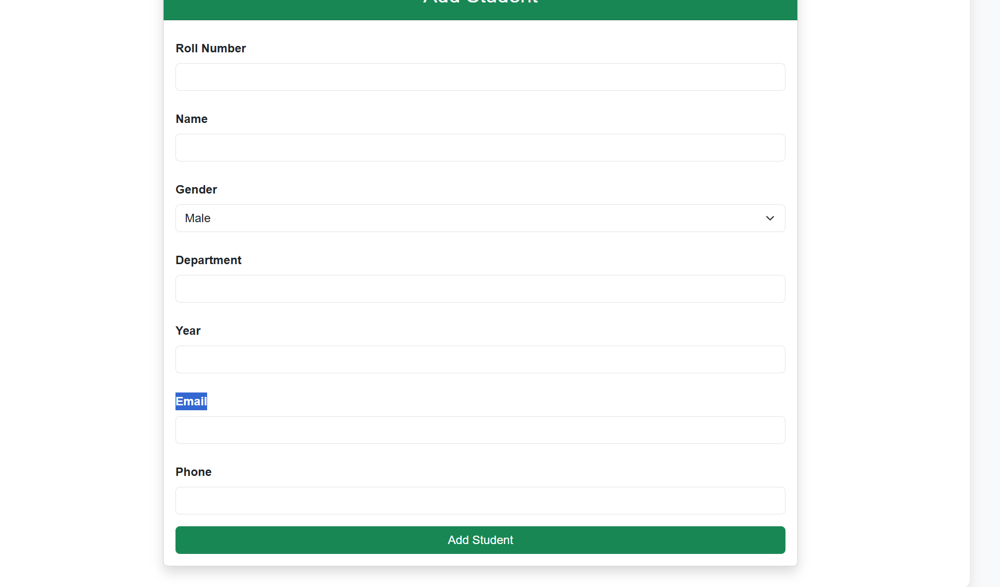
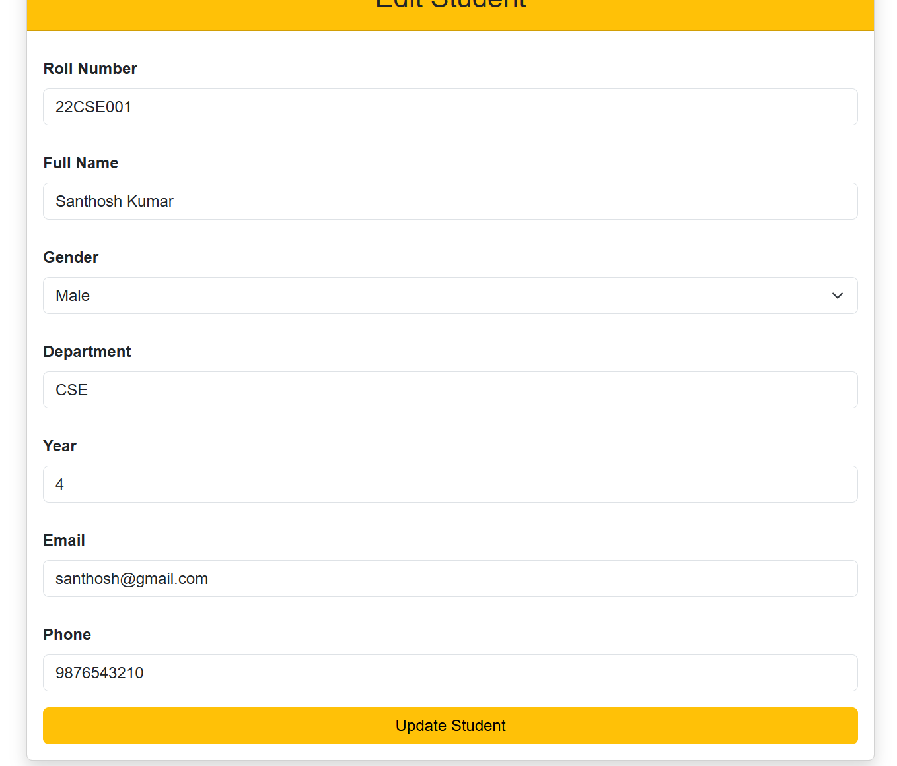

# 🎓 Student Result & Analytics System

A web-based Student Result & Analytics System developed using **Python Flask**, **MySQL**, **HTML**, **CSS**, and **Bootstrap**. The application helps manage student records and provides basic analytics through an interactive dashboard.

---

## 🚀 Features

- ➕ Add Student
- 📋 View Students
- ✏️ Edit Student Details
- 🗑️ Delete Student
- 🔍 Search Students by Name or Roll Number
- 📊 Dashboard Analytics
  - Total Students
  - Total Subjects
  - Average Marks
- 💾 MySQL Database Integration
- 🎨 Responsive UI using Bootstrap

---

## 🛠️ Technologies Used

- Python
- Flask
- MySQL
- HTML5
- CSS3
- Bootstrap 5

---

## 📁 Project Structure

```text
Student-Result-Analytics-System/
│
├── Database/
├── Docs/
├── Python/
│   ├── app.py
│   ├── db.py
│   ├── static/
│   └── templates/
```

---

## ▶️ How to Run the Project

1. Clone the repository

```bash
git clone https://github.com/santhoshkumarsadu2000-hash/Student-Result-Analytics-System.git
```

2. Install the required packages

```bash
pip install flask pymysql
```

3. Configure your MySQL database.

4. Run the application

```bash
python app.py
```

5. Open your browser and visit:

```text
http://127.0.0.1:5000
```

---
## 📸 Project Screenshots

### Dashboard



### Students Page



### Add Student Page



### Edit Student Page



## 👨‍💻 Author

**Santhosh Kumar**

GitHub:
https://github.com/santhoshkumarsadu2000-hash

---

⭐ If you like this project, consider giving it a star!
